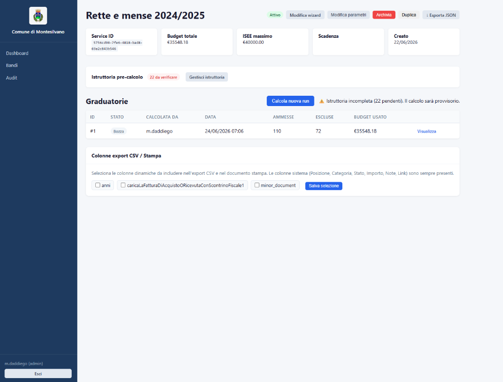
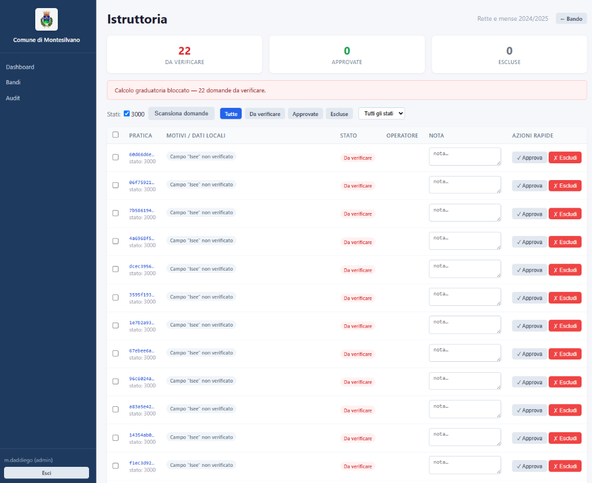

# opencity-gestionale

Gestionale web per la gestione di bandi e graduatorie su [OpenCity Italia](https://opencityitalia.it/) (La Stanza del Cittadino).

Sviluppato per il **Comune di Montesilvano** — adattabile a qualsiasi ente che utilizzi OpenCity Italia.

## Screenshots

### Dashboard del Bando


### Gestione Istruttoria


## Funzionalità

- **Wizard motore di calcolo** — configura un nuovo bando in 7 step guidati: connetti servizio → scegli tipo bando → mappa campi → filtri → tipologie → rimborso → test e attiva
- **Engine generico universale** — un unico engine configurabile via JSON per qualsiasi tipo di bando: fondi, posti, ammissione libera, lista d'attesa
- **Calcolo graduatorie** — fetch istanze da OpenCity API v2, calcolo con algoritmo definito dalla configurazione del bando
- **Documento stampabile** — genera prospetto graduatoria anonimizzato (CF oscurato) con colonne configurabili, stampa direttamente da browser → PDF
- **Bulk approve/reject** — approva o rifiuta pratiche in massa con messaggio personalizzato direttamente su OpenCity
- **Audit trail** — ogni azione (calcolo, approvazione, rifiuto, pubblicazione) tracciata con operatore, esito e messaggio
- **Auth delegata a OpenCity** — le credenziali sono quelle del portale operatori, nessuna gestione password separata
- **Export CSV** — graduatorie esportabili con separatore `;` compatibile con Excel italiano
- **Workflow pubblicazione** — le graduatorie nascono in bozza (visibili solo agli admin), vengono pubblicate quando pronte

## Stack

| Layer | Tecnologia |
|-------|-----------|
| Backend | Go 1.22+ `net/http` stdlib |
| Frontend | HTMX + `html/template` |
| Database | SQLite (`modernc.org/sqlite` — pure Go, no CGO) |
| Deploy | Docker/Podman rootless |
| CI/CD | GitHub Actions → GHCR |

## Avvio rapido

### Prerequisiti

- Go 1.22+
- Docker / Podman

### Sviluppo locale

```bash
git clone https://github.com/Comune-di-Montesilvano/opencity-gestionale.git
cd opencity-gestionale

cp .env.example .env
# modifica .env con le credenziali reali
go run ./cmd/server
```

Apri `http://localhost:8080` e accedi con le credenziali OpenCity.

### Docker

```bash
cp .env.example .env
# modifica .env con SECRET_KEY e credenziali reali
docker compose up -d
```

## Configurazione

| Variabile | Default | Descrizione |
|-----------|---------|-------------|
| `OPENCITY_BASE_URL` | — | **Obbligatoria.** URL base istanza OpenCity |
| `SECRET_KEY` | — | **Obbligatoria.** Min 32 caratteri. Genera con `openssl rand -hex 32` |
| `ADMIN_USERNAMES` | — | Username admin separati da virgola |
| `DB_PATH` | `gestionale.db` | Path file SQLite |
| `PORT` | `8080` | Porta HTTP |
| `TRUST_PROXY` | `false` | `true` se dietro reverse proxy HTTPS (abilita cookie `Secure`) |

## Prima configurazione

Al primo avvio il database è vuoto. Accedi con un account admin e vai su `/motori/nuovo`:

1. **Connetti servizio** — verifica connettività verso OpenCity, carica lista servizi disponibili
2. **Tipo bando** — scegli la modalità: fondi (rimborso €), posti limitati, ammissione libera, lista d'attesa
3. **Mappa campi** — visualizza il JSON reale delle istanze e mappa i campi logici (ISEE, CF figlio, date, ecc.)
4. **Filtri** — aggiungi criteri di esclusione automatica (es. ISEE > 40000, età figlio > 14 anni)
5. **Tipologie** — definisci le categorie con priorità e limiti (budget € o numero posti); saltato per ammissione/lista d'attesa
6. **Rimborso** — scegli modalità netto/lordo e campi sorgente; saltato se non si assegnano fondi
7. **Test + Attiva** — esegui il calcolo su tutte le istanze reali e verifica il risultato, poi attiva

Il motore è disponibile agli operatori non appena attivato. Ogni bando ha la propria configurazione indipendente.

## Tipi di bando supportati

| Modalità | Comportamento |
|----------|--------------|
| `fondi` | Rimborso € per istanza fino a esaurimento budget. Supporta tipologie con budget fisso, percentuale o residuo |
| `posti` | Primi N ammessi per tipologia, nessun rimborso |
| `ammissione` | Tutti coloro che superano i filtri sono ammessi, senza limiti |
| `lista_attesa` | Come ammissione, ma con ordinamento per criterio (tipicamente data di presentazione) |

## Operatori filtro disponibili

Il wizard step 4 permette di costruire filtri su qualsiasi campo mappato:

| Dominio | Operatori |
|---------|-----------|
| Numerico / Count | `<=` `>=` `==` `!=` `<` `>` `tra` (min,max) |
| Stringa | `==` `!=` `contiene` `inizia_con` `finisce_con` `in` `non_in` `vuoto` `non_vuoto` |
| Booleano | `vero` `falso` |
| Data | `prima_di` `dopo_di` `eta_max` `eta_min` |
| Codice Fiscale | `cf_eta_max` `cf_eta_min` `cf_anno_max` `cf_anno_min` `cf_sesso` `cf_comune` `cf_valido` |

## Deploy in produzione

Il gestionale è pensato per girare dietro un reverse proxy esistente (nginx, Caddy) che gestisce TLS.

```bash
# Sul server
cp .env.example .env
chmod 600 .env
# Modifica .env

docker compose up -d
```

Per aggiornare: crea un tag Git → CI pubblica nuova immagine su GHCR → pull sul server.

```bash
git tag v1.0.0 && git push origin v1.0.0
# attendi CI (~2 min)
ssh server "cd /opt/gestionale && docker compose pull && docker compose up -d"
```

## Licenza

[EUPL 1.2](LICENSE) — Licenza Pubblica dell'Unione europea
